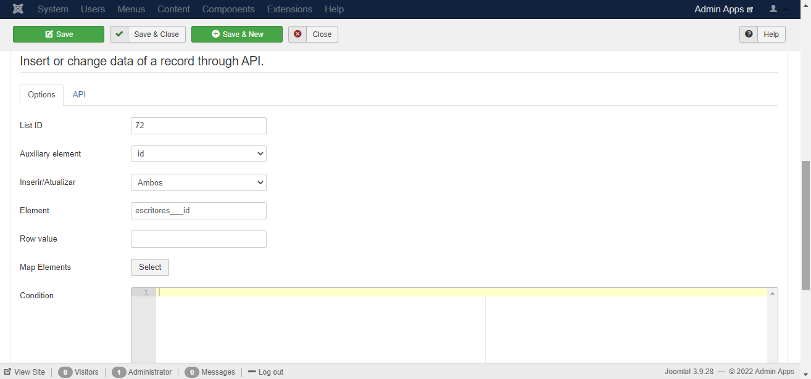

# Rest Upsert

## Instalação

Primeiramente, deve-se instalar o plugin. Para isso, em sua tela de administrador do Joomla vá em Extensions->Manage->Install e clique na aba Upload Package File como na imagem abaixo.

 

Após isso, basta navegar aos arquivos .rar das duas extensões necessárias e arrastar para a caixa de seleção, se ocorrer tudo como esperado na instalação o resultado deve ser o seguinte.

## Configurações Iniciais

Após a instalação deste plugin é importante entender o relacionamento que o mesmo possui com o plugin fabrik_api. Como o armazenamento dos dados é feito via API em outro sistema tomamos como padrão a utilização da fabrik_api, ou seja, é possível utilizar outra API entretanto a recomendação é a utilização da farbik_api em conjunto. Dessa forma, é de extrema importância instalar e configurar a mesma no sistema de destino dos dados, para isso acesso o link abaixo e siga as instruções.

<https://github.com/jlowcode/fabrik_api>

Após a correta configuração da API o próximo passo é configurar os campos do plugin vinculados ao formulário em que deseja que o processo de armazenamento remoto ocorra. Para isso vá em Components->Fabrik->Forms como abaixo.

Em seguida, clique no formulário em que deseja deixar configurado e depois vá na aba Plug-ins e clique em Add, se dirija até o final da página onde se encontram as configurações padrões do plugin como ilustra a imagem a seguir.

No primeiro campo deve ser inserido o id da lista configurada corretamente com a fabrik_api no sistema de destino. Em seguida, selecione a chave primária da lista local, como padrão o elemento id da lista. Após, escolha entre as opções abaixo:

1. Both - Sempre que houver alterações e novas dados o plugin agirá realizando a inserção e a atualização dos dados

2. Only insert - Realizará apenas a inserção dos dados via API no sistema de destino

3. Only update - Realziará apenas a atualização dos dados via API no sistema de destino

Escolhida a opção que melhor atende a necessidade, no campo Element digite o elemento fabrik da chave primária da lista de destino. Em seguida, opcionalmente, de um valor padrão ao elemento que será adicionado como chave primária acima. Por fim, selecione na caixa de seleção os valores a serem inseridos na lista de destino, como abaixo. 

Vale ressaltar que na coluna Key, deve ser inserido os elementos fabrik da lista de destino, assim como na coluna Value selecionado o elemento correspondente na lista de origem e, opcionalmente, inserido um valor padrão que será inserido caso Value esteja vazio.

Mapeado os elementos clique em close e se quiser adicione uma condição, como código php, para que o plugin seja acionado. Dessa forma, um exemplo de configuração dessa aba será este a seguir.

Por fim, vá na aba API e forneça a url da api, em nosso caso, a url com o prefixo correto e as configurações da fabrik_api, depois forneça a chave de acesso e o secret configurado no sistema de destino.

Feito isso tudo já estará configurado, clique em Save & Close.

## Utilização

A utilização deste plugin ocorrerá de forma automatica, ou seja, sempre que o formulário configurado for salvo o plugin entrará em ação e salvará/atualizará os dados no sistema de destino.

